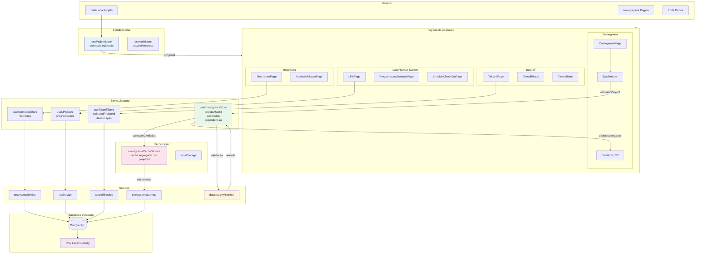
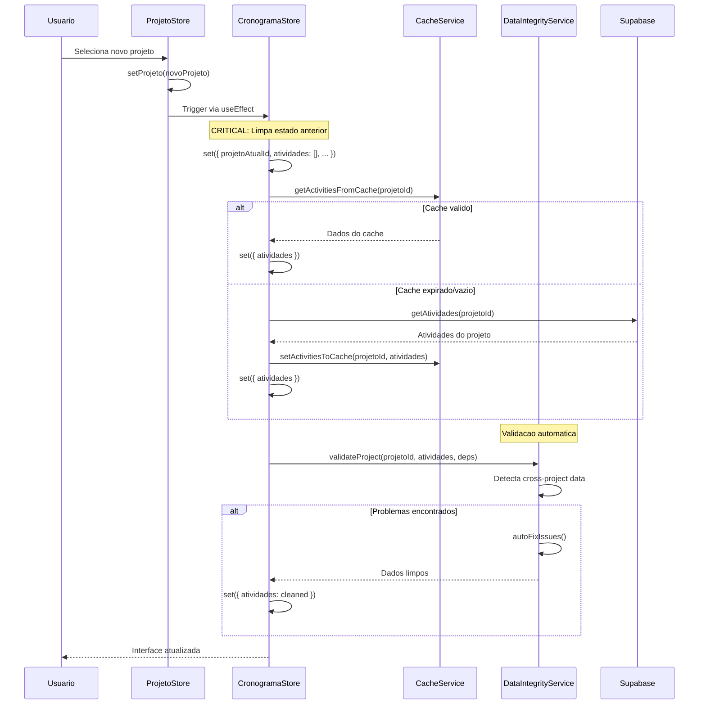

# VisionPlan - Fluxo de Dados e Arquitetura

## Diagrama de Fluxo Principal



## Pontos Criticos de Isolamento de Dados

### 1. CronogramaStore - projetoAtualId
```typescript
projetoAtualId: string | null; // Rastreia projeto atual
carregarAtividades: async (projetoId: string) => {
  // CRITICAL: Limpa estado anterior antes de carregar novo projeto
  set({ 
    projetoAtualId: projetoId,
    atividades: [], // Limpa atividades anteriores
    dependencias: [], // Limpa dependencias
    caminhoCritico: null,
    isLoading: true 
  });
  // ... carrega dados do novo projeto
}
```

### 2. CronogramaCacheService - Segregacao por Projeto
```typescript
const getCacheKey = (type: string, ...ids: string[]): string => {
  return `${CACHE_PREFIX}${type}_${ids.join('_')}`;
  // Resultado: visionplan_cache_activities_PROJECT_ID
};
```

### 3. DataIntegrityService - Validacao Automatica
```typescript
validateProject(projetoId, activities, dependencies) {
  // Detecta atividades de outros projetos
  // Detecta dependencias orfas
  // Detecta parent_id invalidos
  // Auto-corrige problemas encontrados
}
```

## Fluxo de Troca de Projeto



## Regras de Ouro para Isolamento de Dados

1. **Sempre rastrear o projeto atual** - Todos os stores devem ter uma propriedade `projetoAtualId` ou similar
2. **Limpar antes de carregar** - Ao trocar de projeto, SEMPRE limpar o estado anterior antes de carregar novos dados
3. **Validar apos carregar** - Usar DataIntegrityService para validar e auto-corrigir problemas
4. **Cache segregado** - Usar chaves de cache que incluem o projetoId
5. **RLS no banco** - Row Level Security garante isolamento no nivel do banco de dados
